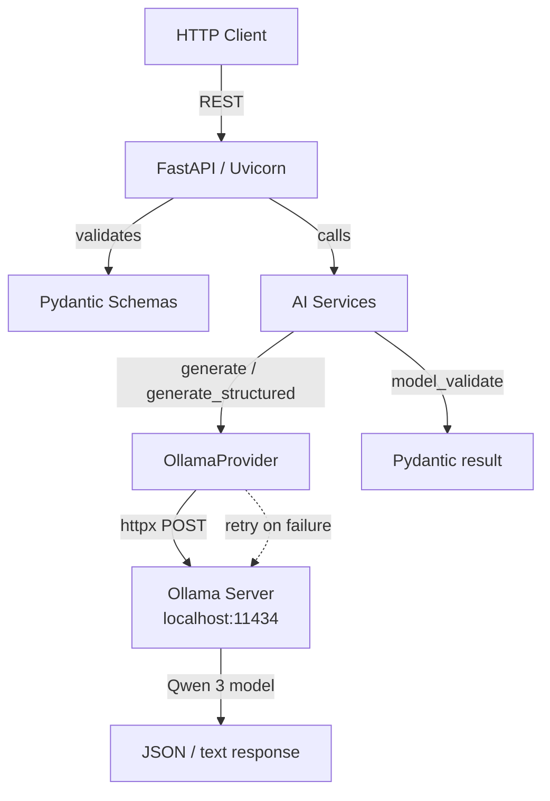

# AI Text Processing API

An async REST API that runs five text-processing operations — summarize, classify, extract entities, rewrite, and translate — through a local Ollama instance (Qwen 3). Built with FastAPI and packaged for Docker.

---

## Overview

This project demonstrates a production-minded pattern for wrapping a local LLM inside a typed, async API:

- **Pydantic schemas** enforce request validation before any network call.
- **Provider abstraction** (`AIProvider` base class) isolates Ollama so other backends can be swapped in later.
- **Tenacity retry** with exponential backoff handles transient connection failures.
- **Structured output** routes (`/classify`, `/extract`) use Ollama's JSON-schema format endpoint and re-validate the response through Pydantic.
- **Docker-ready** out of the box via `docker-compose.yml`.

The API is designed as an AI Engineering portfolio piece — it shows how to turn a raw model call into a reliable service.

---

## Features

| Capability | Endpoint | Method |
|---|---|---|
| Summarize text | `/summarize` | POST |
| Classify text (category + sentiment) | `/classify` | POST |
| Extract named entities | `/extract` | POST |
| Rewrite text in a tone | `/rewrite` | POST |
| Translate text | `/translate` | POST |

**Engineering features:**

- Async HTTP via `httpx`
- JSON-schema constrained generation for structured outputs
- Tenacity retry (3 attempts, exponential backoff 1–4 s) on connection/timeout errors
- Custom exception hierarchy → mapped HTTP status codes (502, 503, 504)
- Structured logging (timestamp, level, logger name, message)
- Pydantic v2 request/response validation
- Docker support via `docker-compose.yml`

---

## Architecture



**Layer descriptions:**

1. **FastAPI** — HTTP router, request binding, exception handling, Swagger/ReDoc docs.
2. **Schemas** — Pydantic models that validate every incoming field before the service layer runs.
3. **AI Services** — Prompt construction and post-processing (JSON parse + Pydantic re-validation for structured endpoints).
4. **Provider** — Abstract `AIProvider` interface with one concrete `OllamaProvider` implementation using `httpx.AsyncClient`.
5. **Ollama** — Local inference server hosting the Qwen 3 1.7B model.

---

## Tech Stack

| Technology | Role |
|---|---|
| Python 3.12 | Runtime |
| FastAPI | Web framework / auto-generated OpenAPI docs |
| Uvicorn | ASGI server |
| Pydantic v2 | Request validation & response models |
| httpx | Async HTTP client for Ollama API |
| Ollama | Local LLM inference server |
| Qwen 3 1.7B | Default inference model |
| tenacity | Retry with exponential backoff |
| python-dotenv | `.env` file loading |
| Docker / docker-compose | Containerized deployment |
| pytest | Test runner |

---

## API Endpoints

### `GET /`

Application info.

**Response**

```json
{"message": "AI text proccesing is running"}
```

---

### `GET /health`

Health check (no AI call).

**Response**

```json
{"status": "healthy"}
```

---

### `POST /summarize`

Summarize free-form text.

**Request body**

```json
{"text": "A very long text here..."}
```

**Response**

```json
{"summary": "Short summary."}
```

---

### `POST /classify`

Classify text into category and sentiment using structured JSON output.

**Request body**

```json
{"text": "I hate this product, it broke after one day."}
```

**Response**

```json
{"category": "complaint", "sentiment": "negative"}
```

---

### `POST /extract`

Extract named entities using structured JSON output.

**Request body**

```json
{"text": "Google was founded by Larry Page in Mountain View."}
```

**Response**

```json
{
  "entities": [
    {"text": "Google", "type": "organization"},
    {"text": "Larry Page", "type": "person"},
    {"text": "Mountain View", "type": "location"}
  ]
}
```

---

### `POST /rewrite`

Rewrite text in a given tone.

**Request body**

```json
{"text": "Hey, wanna grab food?", "tone": "professional"}
```

**Response**

```json
{"rewritten_text": "Would you like to join me for a meal?"}
```

---

### `POST /translate`

Translate text to a target language.

**Request body**

```json
{"text": "Hello, how are you?", "target_language": "indonesian"}
```

**Response**

```json
{"translation": "Halo, apa kabar?", "target_language": "indonesian"}
```

---

## Getting Started

### Prerequisites

- Python 3.12+ (for local development)
- Docker & Docker Compose (for containerized deployment)
- [Ollama](https://ollama.com) installed on the host machine

---

### Option A — Docker (recommended)

Docker Compose runs the API container linked to the host's Ollama instance via `host.docker.internal`.

```bash
# 1. Clone and enter the project
git clone <repo-url>
cd ai-text-processing

# 2. Ensure Ollama is running on the host
ollama list   # should show at least one model

# 3. Pull the default model if not already present
ollama pull qwen3:1.7b

# 4. Build and start
docker compose up --build

# 5. Verify
curl http://localhost:8000/health
# → {"status":"healthy"}
```

The API is now live at `http://localhost:8000`.

---

### Option B — Local Development

Run the API directly on your machine without Docker.

```bash
# 1. Clone and enter the project
git clone <repo-url>
cd ai-text-processing

# 2. Create and activate a virtual environment
python -m venv .venv
# Windows (PowerShell):
.venv\Scripts\Activate.ps1
# Linux / macOS:
source .venv/bin/activate

# 3. Install dependencies
pip install -r requirements.txt

# 4. Configure .env for local (localhost, not host.docker.internal)
# Edit .env and set:
#   OLLAMA_BASE_URL=http://localhost:11434

# 5. Ensure Ollama is running and the model is pulled
ollama list
ollama pull qwen3:1.7b

# 6. Start the server
uvicorn app.main:app --reload --host 0.0.0.0 --port 8000
```

Verify:

```bash
curl http://localhost:8000/health
```

---

## Environment Variables

| Variable | Required | Default | Description |
|---|---|---|---|
| `OLLAMA_BASE_URL` | No | `http://localhost:11434` | Ollama server address. Use `http://host.docker.internal:11434` when running inside Docker. |
| `OLLAMA_MODEL` | No | `qwen3:1.7b` | Model identifier — must match a model available in the running Ollama instance. |
| `AI_TIMEOUT` | No | `120` | Inference timeout in seconds. Cast to float; sub-second precision is supported. |
| `AI_MAX_RETRIES` | No | *(not used)* | Listed in `.env` for reference; the retry count is currently hardcoded to 3 in tenacity. |

---

## Usage Examples

### Summarize

```bash
curl -X POST http://localhost:8000/summarize \
  -H "Content-Type: application/json" \
  -d "{\"text\": \"Artificial intelligence (AI) is the simulation of human intelligence processes by computer systems.\"}"
```

### Classify

```bash
curl -X POST http://localhost:8000/classify \
  -H "Content-Type: application/json" \
  -d "{\"text\": \"The delivery was late and the item was damaged.\"}"
```

### Extract Entities

```bash
curl -X POST http://localhost:8000/extract \
  -H "Content-Type: application/json" \
  -d "{\"text\": \"Google was founded by Larry Page and Sergey Brin in Mountain View, California.\"}"
```

### Rewrite

```bash
curl -X POST http://localhost:8000/rewrite \
  -H "Content-Type: application/json" \
  -d "{\"text\": \"This is awesome dude!\", \"tone\": \"academic\"}"
```

### Translate

```bash
curl -X POST http://localhost:8000/translate \
  -H "Content-Type: application/json" \
  -d "{\"text\": \"Thank you very much\", \"target_language\": \"japanese\"}"
```

---

## API Documentation

When the server is running, FastAPI serves interactive documentation automatically:

- **Swagger UI:** `http://localhost:8000/docs`
- **ReDoc:** `http://localhost:8000/redoc`
- **OpenAPI JSON:** `http://localhost:8000/openapi.json`

These are generated from the route decorators and Pydantic schemas — no extra configuration needed.

---

## Testing

```bash
pytest
```

The test suite covers:

- **`app/test/test_schemas.py`** — Pydantic validation: valid payloads pass, empty text is rejected.
- **`app/services/test_api.py`** — Integration-style endpoint tests using `TestClient` with mocked provider calls (no live Ollama required).

---

## Error Handling

The API returns structured JSON for all error cases:

| Condition | HTTP Status | Error Key |
|---|---|---|
| Missing / invalid request fields | 422 | *(FastAPI default)* |
| Ollama unreachable (DNS, port closed) | 503 | `ai_service_unavailable` |
| Inference exceeds `AI_TIMEOUT` | 504 | `ai_timeout` |
| Ollama returns malformed / empty response | 502 | `invalid_ai_response` |
| Ollama returns HTTP error (4xx/5xx) | 502 | `invalid_ai_response` |

Transient connection and timeout errors are retried automatically up to **3 times** with exponential backoff (1 s, 2 s, 4 s) before the error is returned to the caller.

---

## Project Structure

```
ai-text-processing/
├── app/
│   ├── __init__.py
│   ├── main.py              # FastAPI app, routes, exception handlers
│   ├── schemas.py           # Pydantic request/response models
│   ├── exceptions.py        # Custom exception hierarchy
│   ├── logger.py            # Structured logging configuration
│   ├── providers/
│   │   ├── base.py          # AIProvider abstract base class
│   │   └── ollama.py        # Ollama provider implementation
│   ├── services/
│   │   ├── ai_services.py   # Prompt construction + post-processing
│   │   └── test_api.py      # Endpoint tests with mocked provider
│   └── test/
│       └── test_schemas.py  # Pydantic schema validation tests
├── Dockerfile               # Python 3.12-slim image, uvicorn entrypoint
├── docker-compose.yml       # API service, host.docker.internal networking
├── requirements.txt         # 5 dependencies
├── .env                     # Environment variables (gitignored)
├── .gitignore
└── LICENSE                  # MIT — Copyright (c) 2026 Wilantara
```

---

## Design Decisions

**FastAPI over Flask.** FastAPI's native async support, automatic OpenAPI generation, and Pydantic-based validation reduce boilerplate and catch invalid requests before they reach the AI provider.

**Local Ollama inference.** Running the model locally avoids API keys, rate limits, and network latency. Qwen 3 1.7B is small enough to run on consumer hardware while still producing usable outputs for these task types.

**Async HTTP with httpx.** All provider calls are `async` so the single Uvicorn worker can handle multiple concurrent requests without blocking on I/O.

**Provider abstraction.** The `AIProvider` base class means adding a second backend (OpenAI, Anthropic, etc.) requires only a new subclass — routes and services stay untouched.

**Structured output via JSON schema.** The `/classify` and `/extract` endpoints pass a Pydantic JSON schema to Ollama's `format` parameter. The response is then re-parsed and re-validated through Pydantic, catching any model drift from the expected shape.

**Docker with `host.docker.internal`.** The API container needs to reach Ollama on the host. `docker-compose.yml` sets `OLLAMA_BASE_URL` to `http://host.docker.internal:11434`, which resolves to the host from inside the container on both Linux and Windows.

---

## Limitations

- **Model dependency:** All endpoints require a running Ollama instance with the requested model pulled. No fallback provider is implemented.
- **Single-model per instance:** `OLLAMA_MODEL` selects one model for all operations. Switching models requires a restart.
- **Hardcoded retry count:** The tenacity retry limit (3 attempts) is not exposed as an environment variable — `AI_MAX_RETRIES` in `.env` is ignored.
- **No authentication:** The API is open; add middleware if exposing beyond localhost.
- **Local inference performance:** Output quality and latency depend entirely on the host machine's hardware.

---

## Future Improvements

- Add an alternative provider (e.g., OpenAI) behind the `AIProvider` interface.
- Expose `AI_MAX_RETRIES` as a configurable environment variable.
- Add request-level middleware for rate limiting and authentication.
- Extend test coverage to structured-output endpoints (`/classify`, `/extract`).
- Add streaming support for long-running summarize/translate tasks.

---

## License

MIT License — Copyright (c) 2026 Wilantara. See [`LICENSE`](LICENSE) for details.
